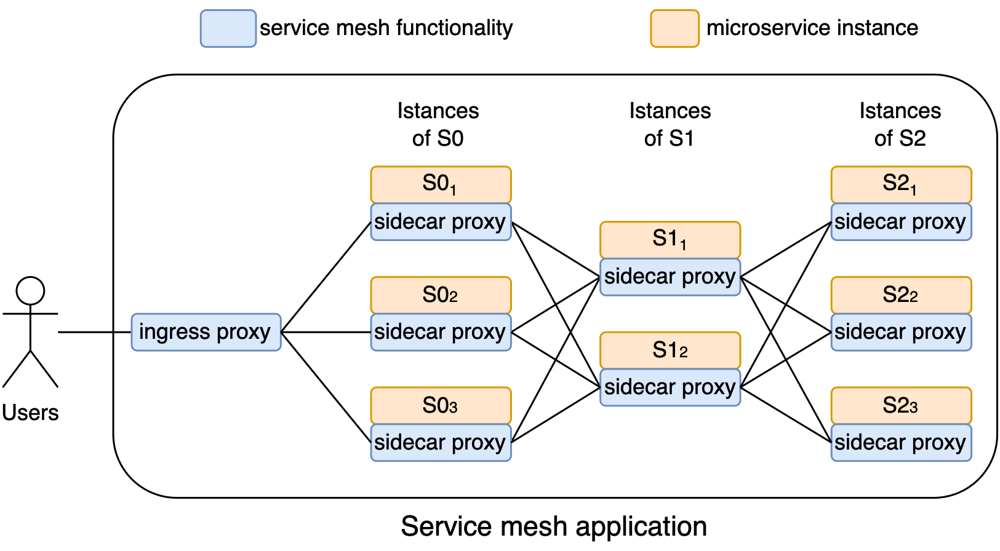
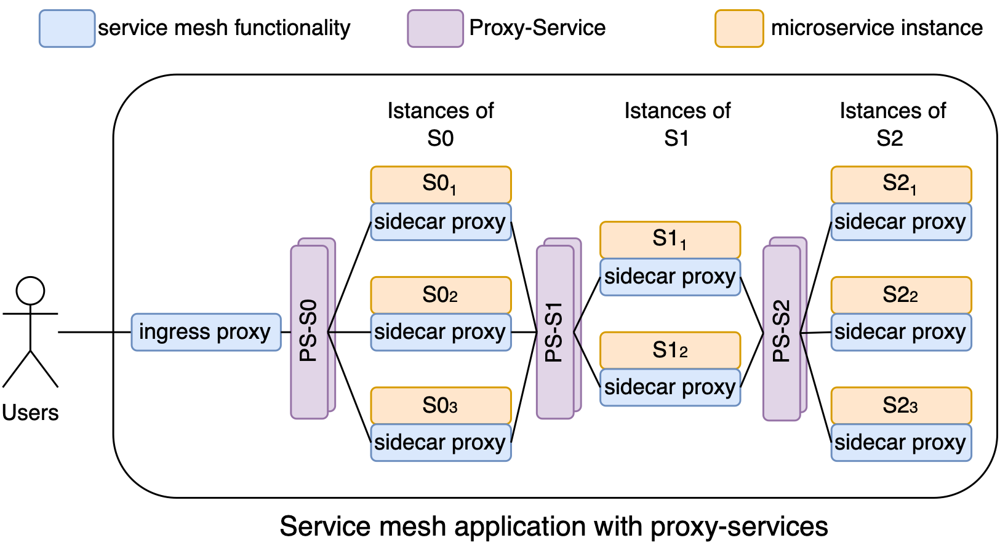

# Proxy-Service

Proxy-Service is a novel [Kubernetes custom resource](https://kubernetes.io/docs/concepts/extend-kubernetes/api-extension/custom-resources/) aimed to recover the effectiveness of [least request](https://www.envoyproxy.io/docs/envoy/latest/intro/arch_overview/upstream/load_balancing/load_balancers) load balancing algorithm for microservice applications where replication is massively used.

<div style="display: flex;">
    
    
</div>

If you have a Kubernetes cluster and Istio installed, you can use the `proxy-service-operator` to handle the `Proxy-Service` custom resources.
The operator will create a new `proxyservice` resource, made of a combination of a Kubernetes Deployment, Service and Horizontal Pod Autoscaler (HPA), that handles the life cycle of a new Istio Gateway, Virtual Service and Destination Rule resources.
Specifically, with the help of the figure above that shows before and after the deployment of the `Proxy-Service` resource in a service mesh application, it will perform the following steps:

- create a new Proxy-Service Kubernetes Deployment, named PS-S0, PS-S1 etc., consisting of a Pod running only an Istio sidecar proxy whose service endpoints are managed by the Istio control plane (Fig. 2). This Pod is actually an Istio Ingress Gateway;
- create a new HPA associated with PS-S0, PS-S1 etc., so that the Pods CPU usage is limited to a specific value, e.g. 70%;
- rename the Kubernetes Service that groups S1 Pods from SN0 to SN0-ep;
- create a new Kubernetes Service named SN0 that groups the Pods of PS-S0. In this way, the PS-S0 Pods transparently intercept all calls to the microservice S0;
- create a new Istio Gateway, Virtual Service and Destination Rule so that requests for SN0 received by the PS-S0 Pods are forwarded to the Pods grouped by SN0-ep using a LOR(2) policy (alias, LEAST_REQUESTS for Istio).

Once running, Proxy-Service resources are automatically managed by the Istio and Kubernetes control planes, thus reliably following the dynamics of the microservices in the cluster.

To deploy the Proxy-Service operator, you can use the provided Kubernetes manifest files located in the `kubernetes` directory:

```bash
$ kubectl apply -f kubernetes/
customresourcedefinition.apiextensions.k8s.io/proxyservices.msvcbench.io created
deployment.apps/proxy-service-operator created
serviceaccount/proxy-service-account created
clusterrole.rbac.authorization.k8s.io/proxy-service-role-cluster created
clusterrolebinding.rbac.authorization.k8s.io/proxy-service-rolebinding-cluster created
```

As a simple example, using `kubectl apply -f example/proxy-service-example.yaml` you will deploy a new Proxy-Service called `ps-s0` that will act as a proxy for the `sn0` service on port 80.

You can display the Proxy-Service custom resource using `kubectl get proxyservices`, or `kubectl get ps` for short.

```bash
$ kubectl get proxyservices
NAME    AGE
ps-s0   7m10s

$ kubectl get service
NAME   TYPE       CLUSTER-IP      EXTERNAL-IP   PORT(S)                                         AGE
sn0    NodePort   10.233.21.253   <none>        15021:31700/TCP,80:30958/TCP,443:30762/TCP      7m10s

$ kubectl get pod
NAME                                    READY   STATUS    RESTARTS   AGE
proxy-service-operator-5f5b6875-gfp85   2/2     Running   0          14m
ps-s0-5c5589b7cd-r97jf                  1/1     Running   0          7m10s
```
